# C#/.NET Boilerplate - Clean Architecture

A production-ready .NET 8 boilerplate implementing Clean Architecture principles with ASP.NET Core Web API, Entity Framework Core, and PostgreSQL.

## 📋 Table of Contents

- [Overview](#overview)
- [When to Use This Boilerplate](#when-to-use-this-boilerplate)
- [Clean Architecture Explained](#clean-architecture-explained)
- [Architecture Diagram](#architecture-diagram)
- [Project Structure](#project-structure)
- [How Components Work Together](#how-components-work-together)
- [Request Flow](#request-flow)
- [Key Concepts](#key-concepts)
- [Getting Started](#getting-started)
- [Technologies](#technologies)

## Overview

This boilerplate provides a solid foundation for building scalable, maintainable, and testable .NET applications. It follows Clean Architecture principles to ensure separation of concerns, making your codebase easier to understand, modify, and test.

**Key Features:**
- ✅ Clean Architecture with clear layer separation
- ✅ RESTful API with ASP.NET Core 8
- ✅ Entity Framework Core with PostgreSQL
- ✅ ASP.NET Identity for authentication
- ✅ Repository pattern for data access
- ✅ Dependency Injection throughout
- ✅ Swagger/OpenAPI documentation
- ✅ SOLID principles applied
- ✅ Docker support

## When to Use This Boilerplate

This boilerplate is ideal for:

- 🎯 **New Web API Projects**: Starting a new REST API with .NET
- 🎯 **Enterprise Applications**: Building scalable, maintainable systems
- 🎯 **Team Projects**: Multiple developers need clear structure and separation
- 🎯 **Long-term Projects**: Applications that will evolve and grow over time
- 🎯 **Learning Clean Architecture**: Understanding how to structure .NET applications properly

**Not ideal for:**
- ❌ Simple CRUD apps without business logic (might be over-engineered)
- ❌ Quick prototypes or MVPs (adds initial complexity)
- ❌ Serverless functions (too heavy for single-function deployments)

## Clean Architecture Explained

Clean Architecture organizes code into layers with clear boundaries and dependencies that flow inward. The goal is to make your business logic independent of frameworks, databases, and external concerns.

### The Three Layers

```
┌─────────────────────────────────────────────────┐
│                                                 │
│              Presentation Layer                 │
│                  (API)                          │
│  Controllers, Middleware, Configuration         │
│                                                 │
└─────────────────┬───────────────────────────────┘
                  │ depends on
                  ▼
┌─────────────────────────────────────────────────┐
│                                                 │
│         Application/Domain Layer                │
│                 (Core)                          │
│  Interfaces, DTOs, Business Logic, Services     │
│                                                 │
└─────────────────┬───────────────────────────────┘
                  │ implemented by
                  ▼
┌─────────────────────────────────────────────────┐
│                                                 │
│            Infrastructure Layer                 │
│             (DataAccess)                        │
│  Repositories, DbContext, External Services     │
│                                                 │
└─────────────────────────────────────────────────┘
```

#### 1. **Presentation Layer** (`backend.Api`)

**What it does:** Handles HTTP requests and responses. This is the entry point for your application.

**Contains:**
- **Controllers**: Receive HTTP requests, validate input, call services, return responses
- **Configuration**: Startup logic, middleware, dependency injection setup
- **API Documentation**: Swagger/OpenAPI configuration

**Key principle:** This layer knows about HTTP, but doesn't contain business logic.

#### 2. **Application/Domain Layer** (`backend.Core`)

**What it does:** Contains your business logic and defines contracts (interfaces) that other layers implement.

**Contains:**
- **Interfaces**: Define what operations are available (e.g., `IAccountCrud`)
- **DTOs (Data Transfer Objects)**: Simple objects for moving data between layers
- **Business Services**: Core business logic and rules
- **Domain Models**: Business entities and value objects

**Key principle:** This is the heart of your application. It has **no dependencies** on external libraries or frameworks.

#### 3. **Infrastructure Layer** (`backend.DataAccess`)

**What it does:** Handles all external concerns like databases, file systems, and third-party APIs.

**Contains:**
- **Repositories**: Implement data access interfaces from Core
- **DbContext**: Entity Framework database configuration
- **Data Models**: Database entities (e.g., `AppUser`, `AppRole`)
- **Migrations**: Database schema changes

**Key principle:** This layer implements interfaces defined in Core, providing concrete implementations for data access.

## Architecture Diagram

```mermaid
graph TB
    subgraph "Presentation Layer (backend.Api)"
        Controller[🎮 Controllers<br/>e.g. AccountController]
        Config[⚙️ Configuration<br/>Startup, Middleware]
    end

    subgraph "Application Layer (backend.Core)"
        Interface[📋 Interfaces<br/>e.g. IAccountCrud]
        DTO[📦 DTOs<br/>Data Transfer Objects]
        Extensions[🔧 Extensions<br/>Shared Logic]
    end

    subgraph "Infrastructure Layer (backend.DataAccess)"
        Repository[💾 Repositories<br/>e.g. AccountRepository]
        DbContext[🗄️ DbContext<br/>Entity Framework]
    end

    subgraph "External"
        DB[(🗃️ Database)]
    end

    %% Request Flow
    Controller -->|uses| Interface
    Controller -->|transfers| DTO
    Repository -->|implements| Interface
    Repository -->|uses| DbContext
    DbContext -->|queries| DB
    Config -->|registers| Repository

    %% Styling
    classDef apiLayer fill:#4A90E2,stroke:#2E5C8A,stroke-width:2px,color:#fff
    classDef coreLayer fill:#50C878,stroke:#2E7D4E,stroke-width:2px,color:#fff
    classDef dataLayer fill:#F39C12,stroke:#C87F0A,stroke-width:2px,color:#fff
    classDef external fill:#95A5A6,stroke:#616A6B,stroke-width:2px,color:#fff

    class Controller,Config apiLayer
    class Interface,DTO,Extensions coreLayer
    class Repository,DbContext dataLayer
    class DB external
```



## Project Structure

```
cs_dotnet_boilerplate/
│
├── src/
│   ├── backend.Api/                    # 🎮 Presentation Layer
│   │   ├── Accounts/
│   │   │   └── *Controller.cs          # Controllers (e.g. AccountController)
│   │   ├── Auth/
│   │   │   └── *Controller.cs          # Controllers (e.g. AuthController)
│   │   ├── Configuration/
│   │   │   ├── Startup.cs              # Service registration & middleware
│   │   │   └── Configuration.cs        # App configuration
│   │   ├── Program.cs                  # Application entry point
│   │   └── appsettings.json            # App settings
│   │
│   ├── backend.Core/                   # 🧠 Application/Domain Layer
│   │   ├── Accounts/
│   │   │   ├── I*Crud.cs               # Interfaces (e.g. IAccountCrud)
│   │   │   └── *Dto.cs                 # DTOs (e.g. UserDto, CreateUserDto)
│   │   ├── Auth/
│   │   │   └── *Dto.cs                 # DTOs (e.g. LoginDto, RegisterDto)
│   │   ├── Emails/
│   │   │   ├── IEmailService.cs        # Service interfaces
│   │   │   ├── EmailService.cs         # Service implementations
│   │   │   └── EmailTemplate.cs        # Email templates
│   │   ├── Extensions/
│   │   │   ├── PageRequest.cs          # Pagination request
│   │   │   ├── PageResult.cs           # Pagination result
│   │   │   ├── IPageable.cs            # Pagination interface
│   │   │   └── QueryableExtensions.cs  # LINQ extensions
│   │   └── Roles/
│   │       ├── Role.cs                 # Role constants
│   │       └── RoleDto.cs              # Role DTO
│   │
│   └── backend.DataAccess/             # 💾 Infrastructure Layer
│       ├── Accounts/
│       │   ├── *Repository.cs          # Repositories (e.g. AccountRepository)
│       │   ├── AppUser.cs              # Database entity for users
│       │   └── AppRole.cs              # Database entity for roles
│       ├── Database/
│       │   ├── AppDbContext.cs         # EF Core database context
│       │   └── AppDbContextFactory.cs  # Factory for migrations
│       ├── Configuration.cs            # Infrastructure DI registration
│       └── DatabaseConfiguration.cs    # Database setup
│
├── backend.sln                         # Solution file
├── Dockerfile                          # Docker configuration
└── README.md                           # This file
```

> **Note:** A `backend.Tests` project for unit and integration tests can be added following the same Clean Architecture principles. Tests would typically mirror the structure of the projects they test and use mocking frameworks to test each layer independently.

## How Components Work Together

### Controllers

**Purpose:** Handle HTTP requests and coordinate the application flow.

**Responsibilities:**
- Receive and validate HTTP requests
- Call appropriate service/repository methods
- Map results to HTTP responses
- Handle errors and return proper status codes

**Example:** `AccountController` receives a POST request to create a user, validates the input, calls `IAccountCrud.CreateAsync()`, and returns the result.

### DTOs (Data Transfer Objects)

**Purpose:** Transfer data between layers without exposing internal implementation.

**Benefits:**
- Decouple API contracts from database models
- Control what data is exposed to clients
- Simplify serialization/deserialization
- Enable API versioning without database changes

**Example:** `UserDto` contains only the data clients need (id, email, username), not internal details like password hashes.

### Interfaces (Contracts)

**Purpose:** Define what operations are available without specifying how they work.

**Benefits:**
- Enable Dependency Injection
- Make code testable (easy to mock)
- Allow swapping implementations without changing consumers
- Enforce clear contracts between layers

**Example:** `IAccountCrud` defines `CreateAsync`, `DeleteAsync`, etc. Any class implementing this can be injected into controllers.

### Repositories

**Purpose:** Handle all database operations and data access logic.

**Responsibilities:**
- Execute database queries
- Map database entities to DTOs
- Handle database transactions
- Implement data access interfaces from Core

**Example:** `AccountRepository` implements `IAccountCrud`, using Entity Framework and ASP.NET Identity to manage user data.

### Services

**Purpose:** Contain business logic that doesn't fit in repositories or controllers.

**Responsibilities:**
- Coordinate complex operations across multiple repositories
- Apply business rules and validation
- Handle cross-cutting concerns (like email notifications)

**Example:** `EmailService` implements `IEmailService` to handle email sending logic.

### Dependency Injection (DI)

**Purpose:** Provide implementations to classes that need them, without tight coupling.

**How it works:**
1. Interfaces are defined in Core (e.g., `IAccountCrud`)
2. Implementations are created in DataAccess (e.g., `AccountRepository`)
3. Services are registered in `Startup.cs` (e.g., `services.AddScoped<IAccountCrud, AccountRepository>()`)
4. ASP.NET Core automatically injects implementations into constructors

**Example:**
```csharp
// Controller constructor - ASP.NET Core injects the implementation
public AccountController(IAccountCrud accountCrud) 
{
    // accountCrud is automatically provided by DI container
}
```

## Request Flow

Here's how a typical request flows through the application:

### Example: Creating a New User

```
1. HTTP Request
   ↓
   POST /Account/create
   Body: { "email": "user@example.com", "userName": "newuser", "password": "Pass123!" }

2. Presentation Layer (backend.Api)
   ↓
   AccountController.Create(CreateUserDto)
   • Validates the request
   • Checks if data is null

3. Application Layer (backend.Core)
   ↓
   IAccountCrud interface defines the contract
   • CreateAsync(CreateUserDto) → Task<UserDto>

4. Infrastructure Layer (backend.DataAccess)
   ↓
   AccountRepository.CreateAsync(CreateUserDto)
   • Validates business rules (email unique, etc.)
   • Creates AppUser entity
   • Uses UserManager (ASP.NET Identity) to save to database
   • Maps AppUser → UserDto

5. Database
   ↓
   PostgreSQL Database
   • User record inserted
   • Transaction committed

6. Response Flow (back up)
   ↓
   UserDto → Repository
   → Interface → Controller
   → HTTP Response
   
   200 OK
   Body: { "id": "guid", "email": "user@example.com", "userName": "newuser" }
```

### Visual Flow Diagram

```
┌─────────────┐
│   Client    │
└──────┬──────┘
       │ HTTP Request (POST /Account/create)
       ↓
┌─────────────────────────────────────────┐
│  🎮 Controller (Presentation Layer)    │
│  • Receives HTTP request                │
│  • Validates input                      │
│  • Calls interface method               │
└──────────────┬──────────────────────────┘
               │ CreateUserDto
               ↓
┌─────────────────────────────────────────┐
│  📋 Interface (Application Layer)       │
│  • IAccountCrud.CreateAsync()           │
│  • Defines contract                     │
└──────────────┬──────────────────────────┘
               │ Implemented by
               ↓
┌─────────────────────────────────────────┐
│  💾 Repository (Infrastructure Layer)   │
│  • AccountRepository.CreateAsync()      │
│  • Business logic & validation          │
│  • Database operations                  │
└──────────────┬──────────────────────────┘
               │ SQL Commands
               ↓
┌─────────────────────────────────────────┐
│  🗄️ Database (PostgreSQL)              │
│  • Saves user record                    │
│  • Returns saved entity                 │
└──────────────┬──────────────────────────┘
               │ AppUser entity
               ↓
┌─────────────────────────────────────────┐
│  💾 Repository                          │
│  • Maps AppUser → UserDto               │
└──────────────┬──────────────────────────┘
               │ UserDto
               ↓
┌─────────────────────────────────────────┐
│  🎮 Controller                          │
│  • Returns HTTP 200 OK                  │
│  • JSON response with UserDto           │
└──────────────┬──────────────────────────┘
               │ HTTP Response
               ↓
┌─────────────┐
│   Client    │
└─────────────┘
```

## Key Concepts

### 1. Separation of Concerns

Each layer has a specific responsibility:
- **API**: HTTP concerns (requests, responses, status codes)
- **Core**: Business logic and rules
- **DataAccess**: Database and external services

### 2. Dependency Inversion

High-level modules (API, Core) don't depend on low-level modules (DataAccess). Both depend on abstractions (interfaces).

```
❌ Bad: Controller → Repository (tight coupling)
✅ Good: Controller → IRepository ← Repository (loose coupling)
```

### 3. Testability

Because of interfaces and DI, you can easily:
- Mock repositories in controller tests
- Test business logic without a database
- Swap implementations for testing

### 4. Maintainability

- **Change database?** Only update DataAccess layer
- **Change API framework?** Only update API layer
- **Change business rules?** Only update Core layer

### 5. SOLID Principles

- **S**ingle Responsibility: Each class has one reason to change
- **O**pen/Closed: Open for extension, closed for modification
- **L**iskov Substitution: Implementations can replace interfaces
- **I**nterface Segregation: Small, focused interfaces
- **D**ependency Inversion: Depend on abstractions, not concretions

## Getting Started

### Prerequisites

- [.NET 8 SDK](https://dotnet.microsoft.com/download/dotnet/8.0) or later
- [PostgreSQL](https://www.postgresql.org/download/) 12 or later
- IDE: [Visual Studio 2022](https://visualstudio.microsoft.com/), [VS Code](https://code.visualstudio.com/), or [Rider](https://www.jetbrains.com/rider/)

### Setup

1. **Clone the repository**
   ```bash
   git clone https://github.com/0xF3546/cs_dotnet_boilerplate.git
   cd cs_dotnet_boilerplate
   ```

2. **Configure database connection**
   
   Update `appsettings.json` in `src/backend.Api/` with your PostgreSQL connection string:
   ```json
   {
     "ConnectionStrings": {
       "DefaultConnection": "Host=localhost;Database=yourdb;Username=youruser;Password=yourpassword"
     }
   }
   ```

3. **Restore dependencies**
   ```bash
   dotnet restore
   ```

4. **Apply database migrations**
   ```bash
   cd src/backend.Api
   dotnet ef database update --project ../backend.DataAccess
   ```

5. **Run the application**
   ```bash
   dotnet run
   ```

6. **Access the API**
   - API: `https://localhost:5001`
   - Swagger UI: `https://localhost:5001/swagger`

### Docker Setup (Alternative)

1. **Build and run with Docker**
   ```bash
   docker build -t dotnet-boilerplate .
   docker run -p 5000:80 dotnet-boilerplate
   ```

## Technologies

### Core Technologies
- **.NET 8**: Latest LTS version of .NET
- **C# 12**: Modern C# language features
- **ASP.NET Core**: Web API framework

### Data Access
- **Entity Framework Core 9**: ORM for database access
- **PostgreSQL**: Relational database
- **ASP.NET Identity**: Authentication and user management

### API & Documentation
- **NSwag**: OpenAPI/Swagger documentation
- **RESTful API**: Industry-standard API design

### Architecture & Patterns
- **Clean Architecture**: Layer separation and dependency inversion
- **Repository Pattern**: Abstraction over data access
- **Dependency Injection**: Built-in DI container
- **SOLID Principles**: Design principles for maintainable code

### DevOps
- **Docker**: Containerization support
- **Entity Framework Migrations**: Database version control

## Contributing

This is a boilerplate project. Feel free to:
- Fork and customize for your needs
- Submit issues for bugs or improvements
- Create pull requests with enhancements

## License

This project is provided as-is for educational and commercial use.

---

**Happy Coding!** 🚀

For questions or support, please open an issue on the GitHub repository.
